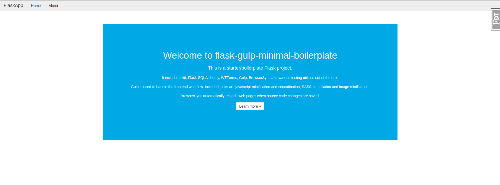

# flask-gulp-minimal-boilerplate

Minimal boilerplate/starter project for Flask 0.11 with Gulp for managing frontend assets.

[](https://travis-ci.org/hypebeast/flask-gulp-minimal-boilerplate)



[Demo](https://flaskgulpboilerplate-prod.herokuapp.com)


## Features

  * [Flask 0.11](http://flask.pocoo.org/)
  * [Flask-SQLAlchemy](http://flask-sqlalchemy.pocoo.org), [Flask-WTF](https://flask-wtf.readthedocs.io/en/stable/), [flask-migrate](https://flask-migrate.readthedocs.io/en/latest/), [Flask-DebugToolbar](https://flask-debugtoolbar.readthedocs.io/en/latest/)
  * [UiKit](https://getuikit.com/): UIkit gives you a comprehensive collection of HTML, CSS, and JS components which is simple to use, easy to customize and extendable.
  * [Gulp](http://gulpjs.com/)
  * [BrowserSync](https://www.browsersync.io/)
  * Utilize best Flask practices with [Application Factories](http://flask.pocoo.org/docs/0.11/patterns/appfactories/) and [Blueprints](http://flask.pocoo.org/docs/0.11/blueprints/) patterns to structure the code and enables the creation of large applications
  * [pytest](http://doc.pytest.org/en/latest/), [webtest](http://docs.pylonsproject.org/projects/webtest/en/latest/), [factory_boy](https://factoryboy.readthedocs.io/en/latest/)
  * [Flake8](http://flake8.pycqa.org/en/latest/) and [isort](https://github.com/timothycrosley/isort)
  * Custom shell commands (clean, lint, test, urls)


## Requirements

  * Python >= 2.7
  * Node >= v4
  * npm
  * gulp


## Quickstart

First, clone the repository:

```
$ git clone https://github.com/hypebeast/flask-gulp-minimal-boilerplate
```

Initialize a new git repository:

```
$ cd flask-gulp-minimal-boilerplate
$ rm -rf .git
$ git init
$ git add .
$ git commit -m 'initial commit'
```

Create a new virtualenv:

```
$ virtualenv env
$ source env/bin/python
```

Install Python, Node and Bower packages:

```
$ pip install -r requirements/dev.txt
$ npm install
$ bower install
```

Build all frontend assets:

```
$ gulp build
```

You must set some Flask environment variables before you can run shell commands:

```
$ export FLASK_APP=/path/to/app.py
$ export FLASK_DEBUG=1
```

Then run the development server:

```
$ flask run
```

### Gulp + BrowserSync Workflow

If you want to enable live-reloading of changes you need to start BrowserSync:

```
$ gulp
```

This starts the development server and BrowserSync.

If you want to run the development server manually run the `dev` task:

```
$ gulp dev
```


## Shell Commands

Available Flask shell commands:

  * **clean**: Remove .pyc and .pyo files recursively
  * **run**: Runs a development server
  * **test**: Run the tests
  * **urls**: Display all routes
  * **db**: Performe database migrations
  * **shell**: Runs a shell in the app context

Run `flask` to see all available commands.


## Gulp

The frontend workflow is based on [Gulp](http://gulpjs.com/). It handles Javascript files (minification, concatination), SASS files (compile to CSS) and images. Furthermore, BrowserSync provides live-reloading of the web page on changes.

The following Gulp tasks are available:

  * **default**: Build all files, starts the Flask server, runs BrowserSync and watches for file changes.
  * **build**: Build all files
  * **build:watch**: Build and watch for file changes
  * **dev**: Build, watch for file changes and start BrowserSync


## Tests

Run the tests with:

```
$ flask test
```


## Database Migrations

First, initialize the database:

```
$ flask db init
```

Run the inital migration:

```
$ flask db migrate
```

Apply the migrations:

```
$ flask db upgrade
```


## Deployment

Make sure that the `FLASK_DEBUG` environment variable is unset or set it to `0`, so that `ProdConfig` is used.


## TODOs

  * Add `fabfile.py` to interact with Heroku
  * Add `Dockerfile` and `docker-compose`  


## Credits

  * [cookiecutter-flask](https://github.com/sloria/cookiecutter-flask)
  * [cookiecutter-django](https://github.com/pydanny/cookiecutter-django)


## License

See [License](./LICENSE).
